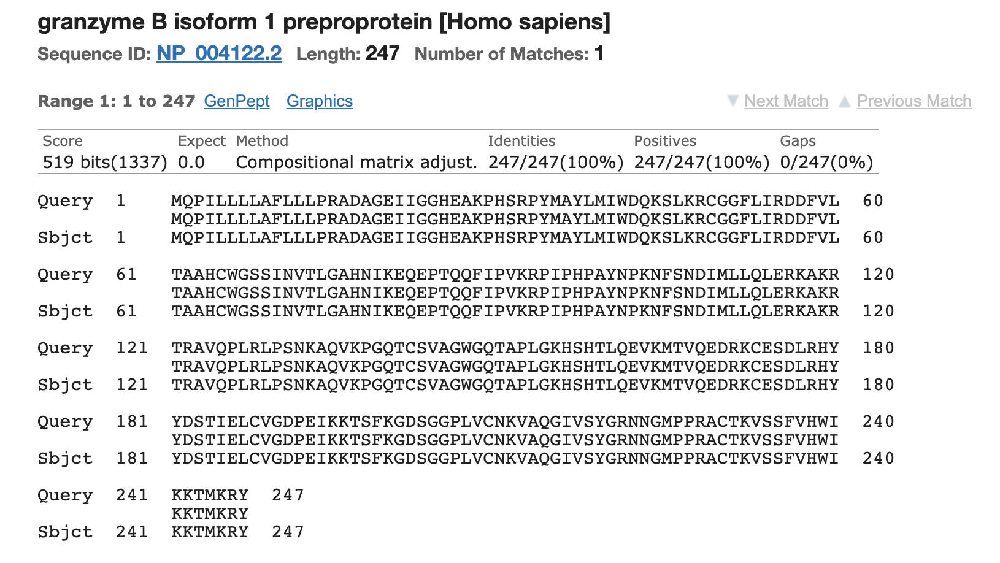

```{r, echo = FALSE}
library(bookdown)
```

## 1. Abstract {-}

**Background:** Protein complexity arises from surprisingly simple building blocks, such as motifs and domains. Therefore, the functionality of topologically similar proteins can be predicted based on their elementary components. Such knowledge can also be transferred to newly discovered proteins, whose functions are not yet known. Due to the great variety of available Bioinformatics tools, it might be complicated to choose the right one for the addressed question. The goal of this report lies in demonstrating the proper use of some of these tools to conduct a structural analysis of the human Granzyme B.

**Results:** The human Granzyme B was identified as such via BLAST and its topological domains were predicted with multiple software. Its sequence was then three-dimensionally aligned to that of a similar protein, Granzyme H, which proved intermediate sequence conservation but high structure conservation. Next, an MSA was performed among various orthologs of Granzyme B and the corresponding phylogenetic tree was thereby reconstructed. This resulted in a visual interpretation of the evolutionary pattern of Granzyme B as well as an assessment of its conserved regions.

**Conclusions:** The immunological importance of Granzyme B as well as the Granzyme family is shown by the presence of these enzymes among several animals, where their sequences and binding sites might not necessarily stay unmodified. This variability could trigger enzyme paralogs as well as orthologs to target a large number of substrates, reflecting the proteomes of various pathogens. Finally, the Tripsin motif present in Granzyme B might cause the pyrolytic activity of this enzyme.

**Keywords:** protease Granzyme B, CD8+ T lymphocyte and NKT cell, BLAST, secondary structure analysis, multiple sequence alignment (MSA)


## 2. Background {-}

The systematic analysis of protein structures has enabled researchers to connect the geometry of a protein with the functions it performs. As this knowledge broadens to newly discovered enzymes, their activity can be predicted based on their elementary components, such as motifs and domains, which often underpin the observed functionality. Similarly to incredible constructions built from simple LEGO bricks, several proteins arise from assembling the identical set of building blocks in different ways. A greater understanding of how proteins are assembled in terms of their topological elements could lead to important achievements, such as drug synthesis and plastic digestion.

Since the original research introduced traditionally accepted methods, such as the PAM[@dayhoff197822] and BLOSUM[@henikoff1992amino] score matrices or the Chou-Fasman algorithm[@chou1974prediction], the techniques of choice have dramatically advanced to achieve a large variety of open source multifunctional as well as single-function software. In the same line, high-throughput sequencing, enzyme engineering through directed evolution and targeted mutagenesis, but also the simple fact that the scientific community is increasing in size, have produced a massive amount of data to be interpreted, demanding for a faster and more effective analytical framework. The amount of Bioinformatics tools available online might seem overwhelming, therefore young scientists must be prepared to ponder benefits and drawbacks of each of those tools and select the appropriate ones for the question to address.

Assuming such a mindset, in this report a structural analysis is conducted on an unknown protein, which is then identified as human Granzyme B. This protease is found in the cytosolic granules of CD8+ and TNK cells and is responsible for the apoptosis of target damaged cells in the context of the immune system. [@krahenbuhl1988characterization] [@hameed1988characterization] [@poe1991human]

## 3. Methods {-}

#### 3.1. protein identification {-}
The mysterious protein ID6299 was obtained from the [collection of proteins](https://github.com/january3/Bioinformatics/tree/main/Report/Sequences) kindly provided by Dr. J. Weiner. It was identified through a BLAST search across the reference protein database (refseq_protein).[@altschul1990basic] The same query was also aligned through PSI-BLAST and within multiple databases (nr and swissprot).[@altschul1997gapped] Additional information on the enzyme was collected from its UniProt overview.[@apweiler2004uniprot]

#### 3.2. secondary structure prediction {-}
The online software PredictProtein was employed to predict the features of Granzyme B (secondary structure and sequence conservation).[@rost2004predictprotein] The predictions on aminoacid sequence and coiled-coil abundance were validated by two additional tools: Protscale[@gasteiger2005protein] and COILS[@lupas1991predicting], respectively.

#### 3.3. protein domains determination {-}
Further analyses on the structural domains of Granzyme B were conducted within the two large databases Pfam[@bateman2004pfam] and PDB[@sussman1998protein]. In the former, protein motifs and domains were characterised with a comparative approach, whereas in the latter it was visualised as a christallographic reconstruction.

#### 3.4. secondary structure alignment {-}
The Protein Databank was blasted for similar proteins to Granzyme B[@estebanez2000crystal], from whose results human Granzyme H[@wang2012structural] was selected. Next, the christallographic constructions of the two enzymes were found on the PDB database and their identifiers were passed to the DALI server so as to align their secondary structures with one another.[@holm2010dali]

#### 3.5. multiple sequence alignment {-}
The NCBI BLAST tool was once again run across the nr database with the sequence of Granzyme B as a query. Its results were assessed in combination with the MSAs returned by PredictProtein and [HomoloGene](https://www.ncbi.nlm.nih.gov/homologene) to select 7 elements to include in the MSA, which was generated with the EMBL-EBI tool clustalw[@thompson1994clustal] and confirmed with clustal Omega[@sievers2011fast]. Results of the latter were visualised with the local software Jalview.[@waterhouse2009jalview]

#### 3.6. sequence reconstruction {-}
the R packages _phangorn 2.7.0_[@phangorn2011package], _BiocManager 1.30.16_[@manager2021package] and _seqinr_[@seqinr2007package] were used to create, optimise and bootstrap a phylogenetic tree out of the MSA. The resulting phylogenetric tree was compared with the dendogram provided by clustalw upon multiple sequence alignment.[@r2021language] [@rstudio2020ide]

#### 3.7. operational settings {-}
Unless reported, the operational settings of the aforementioned tools were kept at default.

## 4. Results {-}

#### 4.1. Granzyme B characterisation {-}
The unknown amino acid sequence was identified as Granzyme B isoform 1 preproprotein from H. sapiens (first hit). The same query produced analogous hits when aligned with standard BLAST and PSI-BLAST across multiple databases (Figures \@ref(fig:Fig1a) and \@ref(fig:Fig1b)). For further characterisation, the function and subcellular location of Granzyme B were studied: the protein is normally found whether in the extracellular matrix or within the cytosolic granules of CD8+ and NKT lymphocytes, which deliver it into the target cells to activate the apoptotic mechanism of caspase-independent pyroptosis (Figure \@ref(fig:Fig1c)).

```{r Fig1a, fig.align = 'center', out.width = "80%", fig.cap = "Alignment of ID6299 with the first hit of the BLAST search. The score, E-value and percent identity suggest that the two sequences were matched flawlessly.", echo = FALSE}

```

```{r Fig1b, fig.align = 'center', out.width = "80%", fig.cap = "First 10 hits of the BLAST search. All best matched organisms belong to the primates. However, the minuscule E-value of hit 1 and the appearance of two human isoforms (hit 1 and hit 4) indicates the human origin of the protein.", echo = FALSE}

```

```{r Fig1c, fig.align = 'center', out.width = "80%", fig.cap = "Subcellular location of Granzyme B. The yellow regions correspond to the extracellular matrix and the cytosolic granules of T cells, respectively. The enzyme is shipped to the cell membrane with a vescicle and then transferred to the target cell through an immunological synapsis.", echo = FALSE}
knitr::include_graphics('protein identification/subcellular_location.png')
```

#### 4.2. structural and topological prediction {-}
The results of the structural analysis showed that Granzyme B contains several $\beta$ sheets and a small amount of $\alpha$ helices. However, the largest portion of this enzyme is composed of other domains. Besides, the amino acid sequence does not appear to be highly conserved, as there are at least as many significantly low-conservation segments as there are high-conservation ones (Figure \@ref(fig:Fig2a)). To determine what other domains apart from multiple $\beta$ sheet and only few $\alpha$ helix regions form the protein, its sequence was inspected for the presence of potential coiled-coil motifs, which proved not to be the case.

Next, the databases Pfam and PDB were browsed in parallel to examine the topology of Granzyme with a holistic approach. On the one hand, the results clarified that Granzyme B is composed of one Trypsin motif (length: 219 amino acids) as well as several small disordered fragments (Figure \@ref(fig:Fig2b)). On the other hand, it was shown that the protein arises from the combination of two homologous subunits hold together via intermolecular interactions (Figure \@ref(fig:Fig2c)).

```{r Fig2a, fig.align = 'center', out.width = "100%", fig.cap = "Predicted features for the entire legth of human Granzyme B (247 amino acids). Predictions of secondary structure, conservation, protein binding and other properties were returned by PredictProtein. The colour scales are described in detail within the each category.", echo = FALSE}

```

```{r Fig2b, fig.align = 'center', out.width = "30%", fig.cap = "Tabular overview on elementary domains forming Granzyme B. The Trypsin motif spans the largest region (length: 219 amino acids), whereas disordered fragments of 2-10 amino acids are evenly distributed over the sequence", echo = FALSE}

```

```{r Fig2c, fig.align = 'center', out.width = "80%", fig.cap = "Christallographic reconstruction of Granzyme B. The two subunits are coloured by secondary structure: yellow stands for strands, magenta for helices, blue for disordered regions and violet for other.", echo = FALSE}

```

#### 4.3. comparison with Granzyme H {-}
Secondary structure alignments help visualise the regions of high and low similarity between two enzymes, which catalise a common reaction or share the analogous biochemical properties. In this way, it is possible to draw conclusions on the location of their binding sites and their mode of action. As reported in Figure \@ref(fig:Fig3a), the human protease Granzyme H resulted as a high similarity hit of Granzyme B through BLAST and PSI-BLAST across the PDB database, therefore the structures of the two proteins were aligned and compared in terms of sequence and structure conservation (Figures \@ref(fig:Fig3b) and \@ref(fig:Fig3c)). Despite a relatively high sequence variability at some particular sites, the secondary structure is firmly conserved.

```{r Fig3a, fig.align = 'center', out.width = "60%", fig.cap = "Sequence alignment of human Granzymes B and H. The amino acid sequences of Granzymes B and H correspond to the upper and the lower strands, respectively. The letters above and below the alignment indicate whether the amino acid most likely lies within a helix (H), strand (E) or other region (L). Amino acids from position 121 on seem to match less ideally than those upstream.", echo = FALSE}

```

```{r Fig3b, fig.align = 'center', out.width = "60%", fig.cap = "Pairwise alignment by sequence conservation. Granzyme B is represented with the orange backbone and Granzyme H with the green one. The multiple blue sites reflect regions of low similarity between the sequences.", echo = FALSE}

```

```{r Fig3c, fig.align = 'center', out.width = "60%", fig.cap = "Pairwise alignment by structure conservation. Granzyme B is represented with the orange backbone and Granzyme H with the blue one. The few green sites reflect regions of low similarity between the structures.", echo = FALSE}

```

#### 4.4. results of MSA {-}
The sequences of six orthologs and one variant of human Granzyme B were selected so that the MSA could account for various degrees of similarity with respect to human Granzyme B. Figure \@ref(fig:Fig4a) illustrates that, despite a relatively high variability, structural and biochemical properties are preserved across the orthologs. Moreover, the initial segments of most sequences (from position 3 to 15) exhibit a common repeated pattern which is cleaved when the precursor protein becomes mature.

The obtained MSA was then employed to reconstruct the phylogenetic tree of the protein orthologs, which well reflects the evolutionary relationships among the selected mammalian species (Figure \@ref(fig:Fig4b)). Additionally, the sequence reconstruction was validated by comparison with the analogous clustalw dendogram.

```{r Fig4a, fig.align = 'center', out.width = "60%", fig.cap = "MSA among several orthologs of Granzyme B. Colours refer to the clustalx scale and provide a measure of structure conservation.", echo = FALSE}

```

```{r Fig4b, fig.align = 'center', out.width = "80%", fig.cap = "Sequence reconstruction of the Granzyme family. The tree was generated with the upgma algorithm and rooted with M. musculus and R. norvegicous as the outgroups. Bootstrapping values are reported on top of the corresponding branches. The element GRAB HUMAN refers to human Granzyme B, whereas H. sapiens to isoform 2 of the same enzyme.", echo = FALSE}

```

## 5. Conclusions {-}

Generally speaking, this analysis draws to the following points:

1. The Tripsin motif could be responsible for the proteolytic activity of Granzyme B;

2. Proteins from the Granzyme family, such as Granzyme B and H, exhibit a high structure conservation despite some differences at the sequence level;

3. Granzyme B is very recurrent in nature as an essential element of the immune system of several animals;

4. The sequence of the precursor Granzyme B contains an initial repetitive segment which is maintained across several animals.

The Tripsin motif was first observed in the serine protease with the same name.[@koshikawa1994identification] This enzyme is commonly found in the digestive system of multiple vertebrate organisms, where it catalyses protein hydrolysis. Because the Tripsin motif is also present within Granzyme B (Figure \@ref(fig:Fig2b)), this element could be responsible for the proteolytic activity at the protein binding site of the enzyme.

Interestingly, from Figure \@ref(fig:Fig2a) it is possible to infer that protein binding site of Granzyme B does not fully coincide with the highly conserved regions of the sequence. This feature might lead to a relative substrate unspecificity, which could bring benefits in the fight against pathogens with different proteomes.

Moreover, the sequence variability of the binding site, if present in other members of the Granzyme family, could explain why different Granzymes bind to and catalyse the hydrolysis of different proteins. What was unraveled, however, is that changes in the amino acid sequence of these enzymes do not remarkably affect their secondary structures (Figures \@ref(fig:Fig3b) and \@ref(fig:Fig3c)). This aspect should be subject of deeper analysis in the future.

The Granzyme family plays an essential role in the adaptive immune response against viral and bacterial intracellular pathogens, therefore its presence and conservation among several animals, such as those included in Figure \@ref(fig:Fig4b), is not surprising. Additionally, the initial DNA fragment which defines a precursor protein of Granzyme B is conserved across most animals. This suggests that such organisms might coordinate the transcription as well as post-translational modifications of this proteins through analogous mechanisms.

Taken all together, this report shows the incredibly large amount of information on a protein that a structural analysis _in silico_ can convey. In the future, this type of investigation will likely cover an increasingly important position in the discovery of new drugs, the mining of usable natural compounds as well as the response to the climate crisis.

## 6. References {-}